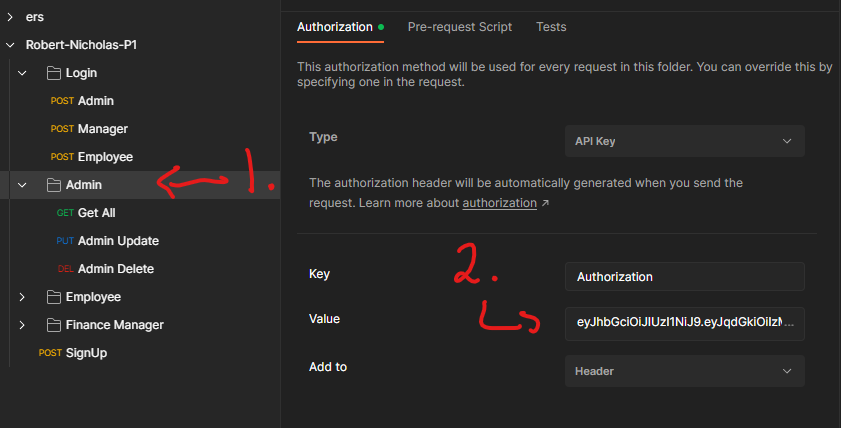
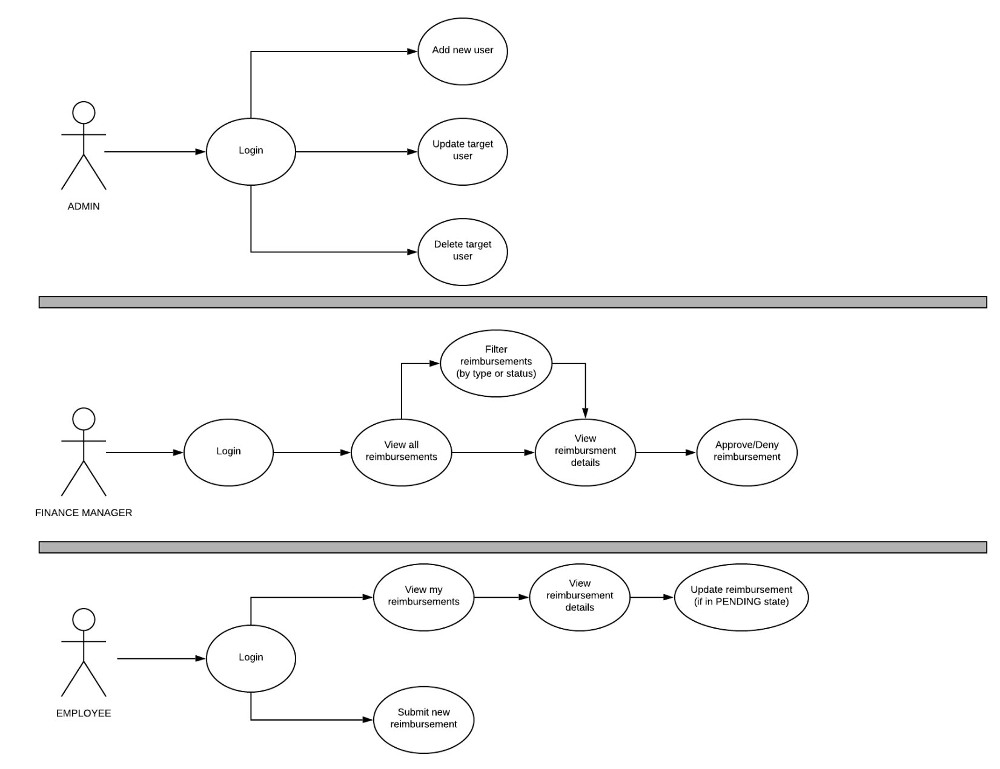
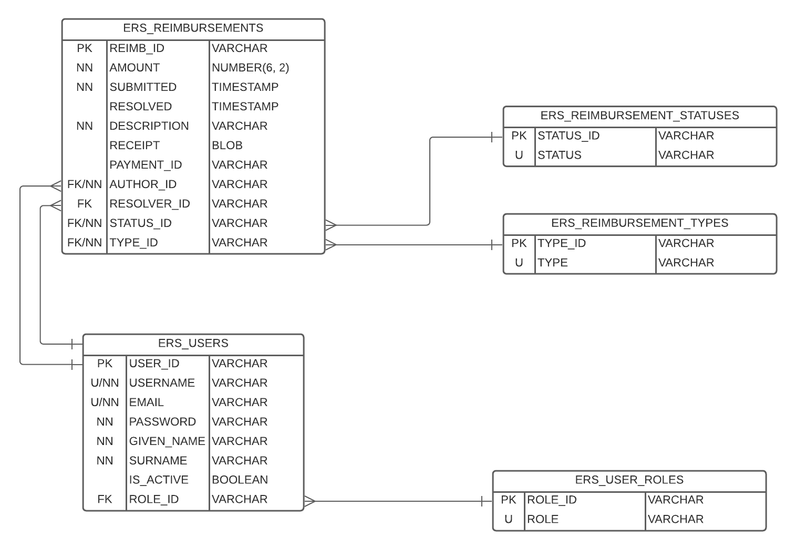

# P1-ERS
### Robert-Nicholas-P1

## Index
- Project Description
- Technologies
- Usage
- Roles
- ER diagram
- Contributors

## Project Description

### Brief

For this project we were tasked with created an API that supports an internal expense reimbursement system. This 
system will assist in the management of reimbursements. Anyone can request an account with the system. However, the
account must be approved by a system admin to log on. All registered employees in the company can log in, submit
reimbursement request, update any pending reimbursements they made, and view their history. Managers can log in and
view all request made to the system. Managers are also authorized to approve or deny any requests made to the system.

### Technology
- Written in Java 8.
- Intellij
- Maven
- JDBC
- Java EE Servlet
- JSON Web Tokens
- PostgresSQL
- DBeaver
- AWS - RDS
- AWS - EC2
- Tomcat
- Jenkins
- Junit
- Mockito
- Postman

## Usage
Postman folder for requests:

- Note: Authorizations keys should be added to the folder NOT the individual requests

  

### Roles
- Admin
- Manager
- Employee

## ERD

## Contributors
- Robert James
- Nicholas Fielder
